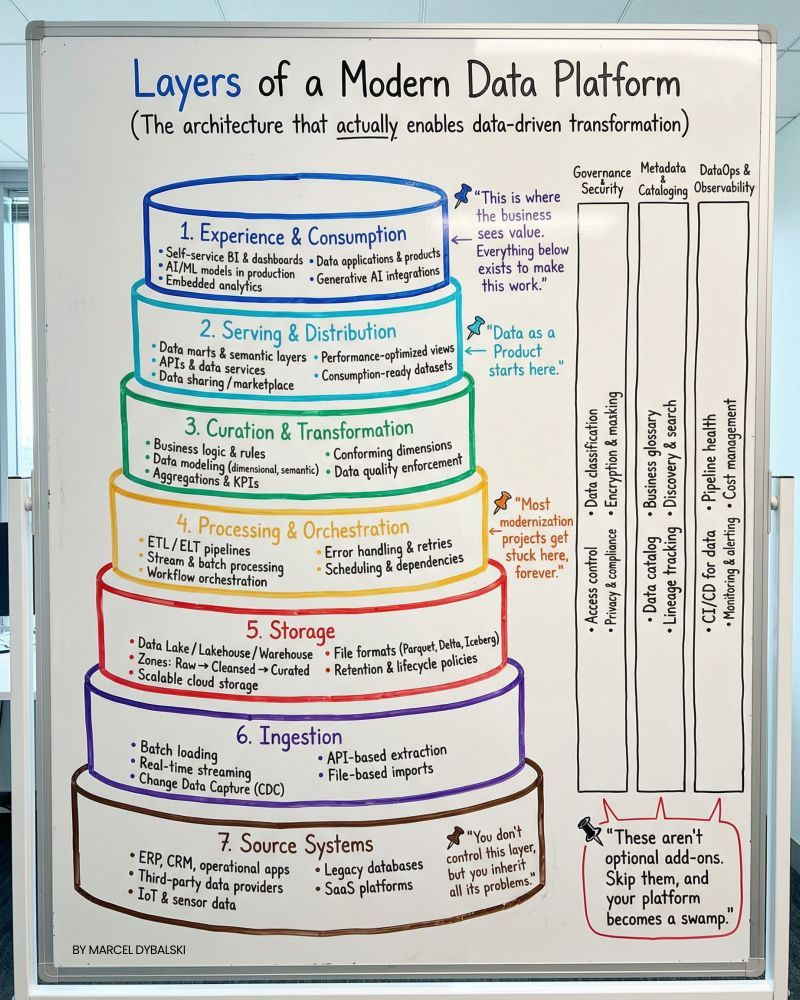

# The Real Structure of a Data Platform

Everyone thinks a data platform starts with a tool. But the real work starts long before that.

Most teams buy a warehouse/lakehouse and assume the platform is "done." But Storage is Layer 5 — and Layers 1–4 (the value-creating ones) often don't exist yet.

## Here's the actual structure:

**7️⃣ Source Systems** – ERP, CRM, SaaS, legacy apps. You inherit their chaos.

**6️⃣ Ingestion** – Batch, streaming, CDC. Not as plug-and-play as it sounds.

**5️⃣ Storage** – Lake / Lakehouse / Warehouse. Necessary, not sufficient.

**4️⃣ Processing** – Pipelines, orchestration, error handling. The bottleneck zone.

**3️⃣ Curation** – Models, metrics, quality. Skip this → 10 versions of the same KPI.

**2️⃣ Serving** – Semantic layers, data marts, APIs. This is where Data-as-a-Product starts.

**1️⃣ Consumption** – Dashboards, analytics, AI models. The only layer the business sees.

## The Foundation

And then the pillars holding everything together:

**Governance** • **Lineage** • **Security** • **Cost control** • **CI/CD** • **Monitoring**

Miss these foundations, and your platform quietly becomes a swamp.

---

**Tools are 20%.**

**Architecture + governance + execution = the other 80%.**

---

