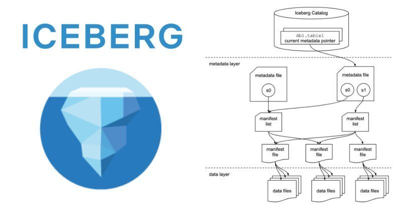

# Apache Iceberg for Data Engineering (Quick Guide 📝)

## Before Understanding Iceberg, Understand Why We Even Need It

I don't want to go into detail because I'll create a video about it but here's a quick summary:

- **We can use Data Warehouse** → It needs structuring before loading
- **We can use Data Lake** → Does not have ACID Transaction, Time Travel, and ease of managing data

We need something that has both capabilities like Databases (ACID, etc...) and flexibility like DataLake

😎 **Enters Open Table Format**, now there are many of them like Apache Iceberg, Delta Lake, Hudi

## 🥶 Let's Explore One: Apache Iceberg 🥶

Think of it as a layer between the storage system and the query engine.

Iceberg is not a storage system or database; it's a table format that sits on top of existing storage systems like S3, HDFS, or ADLS.

It brings structure and reliability to data lakes, which often struggle with issues like slow queries, inconsistent data, and poor performance.

## What Does It Provide?

✅ **Schema Evolution**: Easily add, update, or delete columns without breaking existing queries.

✅ **Time Travel**: Query data as it existed at a specific point in time (e.g., "What did this table look like yesterday?").

✅ **Partitioning and Hidden Partitioning**: Users don't need to worry about partition details; Iceberg handles it under the hood.

✅ **ACID Transactions**: Ensures data consistency with atomic commits, preventing partial or corrupted writes.

✅ **Efficient Metadata**: Uses a layered metadata system (file, snapshot, and manifest levels) to speed up queries.

---

## Let's Quickly Understand Architecture

### 💾 Data Files
The actual data stored in files (e.g., Parquet, Avro, ORC).

### 🗺️ Metadata Layers

Iceberg uses a multi-level metadata system to keep track of data and make queries faster. Think of it as a "map" that helps you find the data you need without scanning everything.

**1. Metadata File**: A JSON file that stores high-level information about the table, like its schema, partition details, and snapshots.

**2. Manifest List**: A file that lists all the manifests for a specific table snapshot (A snapshot is a table version at a specific point in time.)

**3. Manifest File**: A file that lists data files and their metadata (e.g., file path, partition info, statistics like min/max values).

### 🐈 Iceberg Catalog

A central registry (like Hive Metastore, AWS Glue, etc.) that knows about all your tables.

