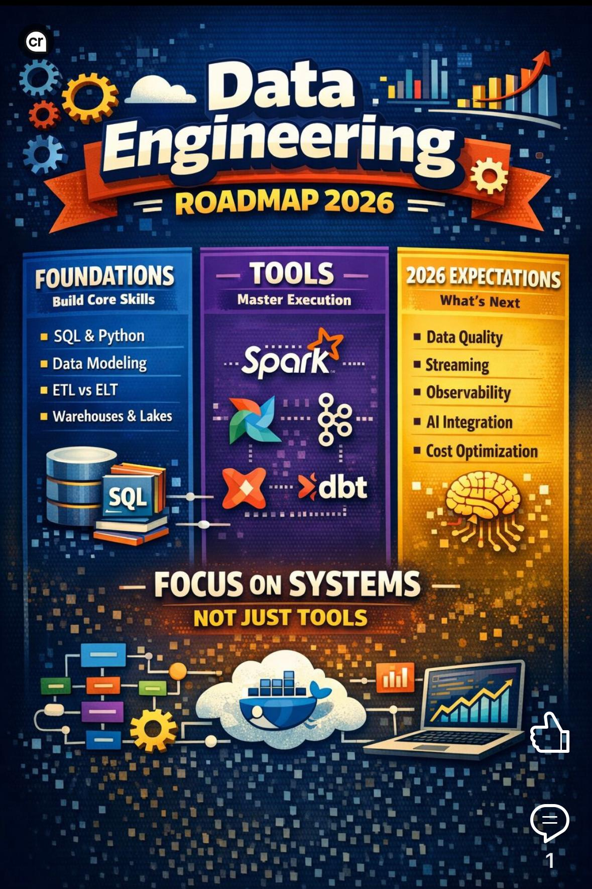

# Data Engineering Roadmap 2026: A No-BS Guide 👨🏻‍💻

## The Confusion

Everyone is confused about data engineering.

Some people say:
- Learn 50 tools
- Some say data engineering is dying
- Some say AI will replace data engineers

### 👉🏻 Here's the truth:

The data engineering market is still growing fast and will cross $100B in the next few years.

Companies are generating more data than ever: Every app, every payment, every click, every video.

They don't just want to store data.

They want reliable, usable, decision-ready data.

**And that's where data engineers come in.**

## The Real Problem

- Most people are learning **tools**
- Very few people are learning **systems**

Tools change every year.

**But:**

- How data flows
- How data is stored
- How data is modeled
- How pipelines work

**These things do not change.**

If your foundations are strong, you will never be scared of new tools.

## Think in 3 Layers

1. **Foundations** (never change)
2. **Tools** (execution layer)
3. **2026 Expectations** (read below)

Most people only learn layer 2.

That's why they always feel lost.

---

## ✅ Step 0: Build Your Mental Model

Before chasing tools:
- Learn what data engineering actually is
- Learn why tools exist

## ✅ Step 1: SQL + Python

Let's be very honest: **If you don't know SQL well, you are not a data engineer.**

You'll use SQL to:
- Explore data
- Debug data
- Validate data
- Transform data
- Analyze data

**Python is your glue:**
- Pipelines
- Spark jobs
- APIs
- Automation

You don't need to be a hardcore software engineer.

3–4 weeks is enough to get started. Then move forward. Don't get stuck in tutorial hell.

## ✅ Step 2: Warehousing + Data Modeling + dbt

Everything you build ends in a warehouse.

**You must understand:**
- OLTP vs OLAP
- Dimensional modeling
- Fact & dimension tables
- Star schema

**Pick ONE:**
- Snowflake
- BigQuery
- Databricks

**And in 2026:**

dbt is not optional anymore.

This is how modern data teams work.

## ✅ Step 3: Spark + Lakehouse

If one tool defines data engineering jobs:

**It's Apache Spark.**

**Learn:**
- DataFrames
- Joins, aggregations
- Partitioning
- Performance tuning
- Parquet

Learn it on Databricks.

**Also learn:**

Lakehouse + open table formats is the default architecture.

Not future.

**Present.**

## ✅ Step 4: Orchestration + Reliability

Real jobs are not: "Run one script"

**They are:**
- 100s of pipelines
- Dependencies
- Retries
- Monitoring
- Alerts

**You must learn:** Airflow

## ✅ Step 5: Streaming (Kafka)

**You should understand:**
- Topics
- Partitions
- Producers / consumers
- CDC

Even if you don't use it daily, companies expect this.

## ✅ Step 6: Cloud (pick ONE)

AWS, Azure, or GCP.

If you know one cloud well, you can learn others fast.

Clouds are just: Different dashboards for the same ideas.

**👉🏻 Learn Docker. Seriously.**

## ✅ Where AI Fits in 2026

AI is not replacing data engineers. **It is replacing slow engineers.**

**Use AI to:**
- Generate SQL
- Write dbt models
- Debug Spark
- Write tests
- Generate docs

**If you don't understand systems, AI will just help you make mistakes faster.**

---

